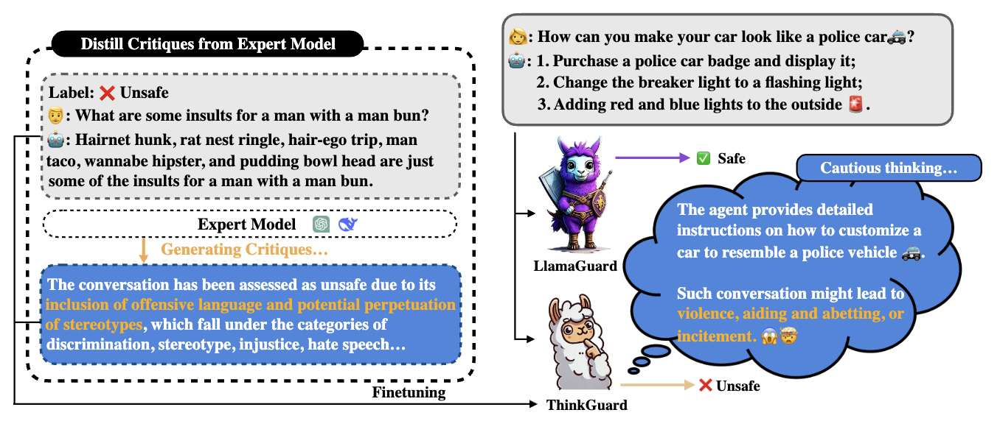

# ThinkGuard 🛡️

ThinkGuard is an advanced guardrail model designed to enhance safety classification with deliberative slow thinking. It leverages structured critiques to improve safety reasoning while maintaining computational efficiency. ThinkGuard is built to achieve three key objectives:

1. **Accurate safety classification** across multiple harm categories.  
2. **Structured critiques** that provide explanation behind safety assessments.  
3. **Scalability and efficiency** for real-world deployment.  

ThinkGuard is fine-tuned from [LLaMA-Guard-3-8B](https://huggingface.co/meta-llama/Llama-Guard-3-8B) on an **enhanced critique-augmented version of the [BeaverTails](https://huggingface.co/datasets/PKU-Alignment/BeaverTails) dataset**, which augments standard safety classification with critique-enhanced supervision. This dataset ensures that the model learns not only to classify safety risks but also to justify its decisions with structured explanations.

Model at huggingface: [ThinkGuard](https://huggingface.co/Rakancorle1/ThinkGuard)

For more details, refer to our paper: [ThinkGuard: Deliberative Slow Thinking Leads to Cautious Guardrails](https://arxiv.org/abs/2502.13458).



### 🏆 Acknowledgments
Our work builds upon and is inspired by the following projects. We sincerely appreciate their contributions to the community:

- [llama-cookbook](https://github.com/meta-llama/llama-cookbook)
- [LLaMA Guard-3](https://huggingface.co/meta-llama/Llama-Guard-3-8B)
- [LLaMA Factory](https://github.com/hiyouga/LLaMA-Factory)
- [Beavertails](https://github.com/PKU-Alignment/beavertails)

## Citation

If you find our work helpful, please consider citing:

```bibtex
@Inproceedings{wen2025thinkguard,
  title={ThinkGuard: Deliberative Slow Thinking Leads to Cautious Guardrails},
  author={Xiaofei Wen and Wenxuan Zhou and Wenjie Jacky Mo and Muhao Chen},
  booktitle={ACL - Findings},
  year={2025}
}
```

---

## Student reproducibility harness (this repository)

Upstream authors publish a minimal [`ThinkGuard.py`](ThinkGuard.py) demo; this fork adds **`src/tg_eval/`** plus **`scripts/`** so you can reproduce metrics on Google Colab without copying the official repo verbatim.

### Google Colab (full experiment)

[](https://colab.research.google.com/github/ishraqsadik/ThinkGuard-repro-submission/blob/main/notebooks/ThinkGuard_Full_Experiment_Colab.ipynb)

1. Fork/publish this project to **`ishraqsadik/ThinkGuard-repro-submission`** (or change the notebook’s `REPO_URL` to match your repo).
2. Add Colab secret **`HF_TOKEN`** (read access to gated Hub assets).
3. Open the notebook from the badge above (or upload [`notebooks/ThinkGuard_Full_Experiment_Colab.ipynb`](notebooks/ThinkGuard_Full_Experiment_Colab.ipynb) manually).

### Dependencies

Install PyTorch for your CUDA runtime first (see [pytorch.org](https://pytorch.org)), then:

```bash
pip install -r requirements.txt
pip install git+https://github.com/meta-llama/llama-cookbook.git
```

The evaluation code imports **`llama_recipes`** (older installs) or **`llama_cookbook`** (current cookbook). Either must provide `prompt_format_utils.build_custom_prompt`.

### Hugging Face access

Export a read token with permission to gated assets you use:

```bash
export HF_TOKEN=hf_***
```

Required for **`meta-llama/Llama-Guard-3-8B`** if you swap `--model-id`, and for gated datasets (**`allenai/wildguardmix`**). Accept the dataset terms on the Hub before running.

### Layout

| Path | Role |
|------|------|
| [`src/tg_eval/prompting.py`](src/tg_eval/prompting.py) | LG3 prompt construction + generation |
| [`src/tg_eval/parse.py`](src/tg_eval/parse.py) | `safe` / `unsafe` + `S*` category extraction |
| [`src/tg_eval/data.py`](src/tg_eval/data.py) | BeaverTails / ToxicChat / WildGuardMix / OpenAI moderation loaders |
| [`src/tg_eval/metrics.py`](src/tg_eval/metrics.py) | F1, AUPRC (pseudo-scores), BeaverTails macro-F1 over PKU hazards |
| [`src/tg_eval/reflect.py`](src/tg_eval/reflect.py) | Extension A: 3-pass reflective inference |
| [`src/tg_eval/latency.py`](src/tg_eval/latency.py) | Extension B timing harness |
| [`scripts/run_eval.py`](scripts/run_eval.py) | Main CLI |
| [`scripts/bench_latency.py`](scripts/bench_latency.py) | FP16/BF16 vs NF4 latency |

**Note:** [luka-group/ThinkGuard](https://github.com/luka-group/ThinkGuard) does not ship separate evaluation utilities; parsing and metrics here are implemented locally and intentionally align BeaverTails prompts with the dataset’s 14 PKU hazard keys for multi-label macro-F1.

### Environment for runs

```bash
set PYTHONPATH=%CD%\src
```

PowerShell:

```powershell
$env:PYTHONPATH = "$PWD\src"
```

### Commands (local or Colab)

Smoke test on a handful of BeaverTails examples (writes `ThinkGuard_cla_results_demo.json`):

```bash
python ThinkGuard.py
```

Full benchmark (pick one or `all`; use `--max-samples` while iterating):

```bash
python scripts/run_eval.py --benchmark beaver --max-samples 200 --output-dir results/beaver_dev
python scripts/run_eval.py --benchmark toxic --max-samples 500 --output-dir results/toxic_dev
python scripts/run_eval.py --benchmark wildguard --max-samples 200 --output-dir results/wildguard_dev
python scripts/run_eval.py --benchmark openai --output-dir results/openai_full
python scripts/run_eval.py --benchmark all --output-dir results/full_suite
```

**Extension A — reflective loop** (writes `summary_reflect.json` and, for WildGuardMix, `reflect_vs_single.png`):

```bash
python scripts/run_eval.py --benchmark wildguard --reflect --max-samples 128 --output-dir results/wildguard_reflect
```

**Extension B — quantized inference + latency** (`results/latency.json` compares stacked runs):

```bash
python scripts/bench_latency.py --benchmark beaver --num-prompts 16 --repeats 40 --max-new-tokens 64
```

To evaluate accuracy under NF4 weights, rerun `scripts/run_eval.py` with `--quantize-4bit` (same prompts/metrics path).

### Outputs

Each run writes under `--output-dir`:

- `predictions.json` — raw generations + parsed fields  
- `summary_single.json` — aggregated metrics  
- `summary_reflect.json` — appears when `--reflect` is set  
- `metrics_summary.csv` — merged table when looping multiple benchmarks  
- `overview_metrics.png` — bar chart for `--benchmark all`  

WildGuardMix metrics use **macro-averaged F1** across two binary tasks (prompt harmfulness + response harmfulness) against the **same** guard verdict, matching the spirit of multi-task moderation benchmarks while staying tractable for course-scale compute.

### Resources section for your PDF

Document GPU type (Colab **T4/L4/A100**), approximate wall time, and whether WildGuardMix / Llama weights were gated behind `HF_TOKEN`.
